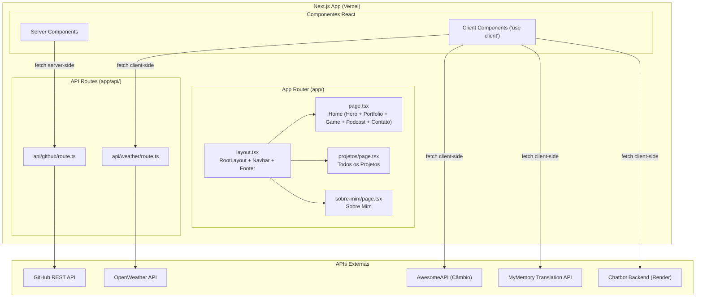
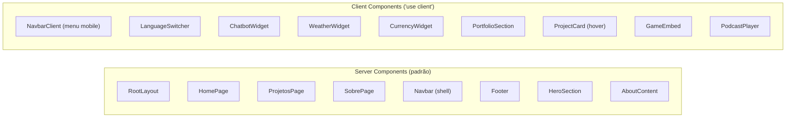
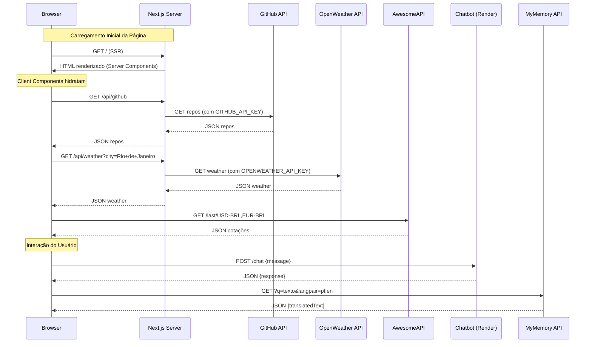

# Documento de Design — Portfolio Redesign Next.js

## Visão Geral

Este documento descreve a arquitetura e o design técnico para a migração do portfólio pessoal de Diogo Bittencourt de um site estático multi-página (HTML5 + Vanilla JS + Tailwind CDN) para uma aplicação Next.js moderna com App Router, React, TypeScript e TailwindCSS instalado via npm.

A migração preserva todas as funcionalidades existentes — cards de projetos GitHub, chatbot Diobot, widgets de clima e câmbio, suporte multi-idioma (PT/EN/ES), podcast player, game embed e página "Sobre Mim" — enquanto aplica um novo design visual dark minimalista inspirado em referência com fundo #0a0a0a, paleta monocromática, elementos geométricos decorativos e tipografia sans-serif limpa.

A sidebar colapsável atual será substituída por uma navbar horizontal fixa no topo. O deploy continua na Vercel, e as serverless functions em `api/` serão migradas para API Routes do Next.js.

### Decisões Técnicas Principais

| Decisão | Escolha | Justificativa |
|---------|---------|---------------|
| Framework | Next.js 14+ App Router | Roteamento automático, Server Components, otimização de imagens, API Routes integradas |
| Estilização | TailwindCSS via npm | Build-time CSS, purge automático, sem CDN em produção |
| Linguagem | TypeScript | Tipagem estática para componentes e funções utilitárias |
| Fonte | Inter via `next/font/google` | Sans-serif moderna, carregamento otimizado sem layout shift |
| Deploy | Vercel | Compatibilidade nativa com Next.js, mesmo host atual |
| Componentes Server vs Client | Server Components por padrão | Client Components apenas para interatividade (chatbot, widgets, language switcher) |

## Arquitetura

### Diagrama de Arquitetura



### Estratégia Server vs Client Components



### Estrutura de Diretórios

```
portfolio-nextjs/
├── app/
│   ├── layout.tsx              # RootLayout (fonte, metadata global, Navbar, Footer)
│   ├── page.tsx                # Home (Hero + Portfolio + Game + Podcast + Contato)
│   ├── projetos/
│   │   └── page.tsx            # Página de todos os projetos
│   ├── sobre-mim/
│   │   └── page.tsx            # Página Sobre Mim
│   ├── globals.css             # Estilos globais + imports Tailwind
│   └── api/
│       ├── github/
│       │   └── route.ts        # API Route proxy GitHub
│       └── weather/
│           └── route.ts        # API Route proxy OpenWeather
├── components/
│   ├── Navbar.tsx              # Navbar (Server Component shell)
│   ├── NavbarClient.tsx        # Navbar interativa (Client Component - menu mobile)
│   ├── Footer.tsx              # Footer
│   ├── HeroSection.tsx         # Hero section
│   ├── PortfolioSection.tsx    # Seção de projetos (Client Component)
│   ├── ProjectCard.tsx         # Card de projeto individual (Client Component)
│   ├── ChatbotWidget.tsx       # Widget do Diobot (Client Component)
│   ├── WeatherWidget.tsx       # Widget de clima (Client Component)
│   ├── CurrencyWidget.tsx      # Widget de câmbio (Client Component)
│   ├── LanguageSwitcher.tsx    # Seletor de idioma (Client Component)
│   ├── PodcastPlayer.tsx       # Player Spotify embed
│   ├── GameEmbed.tsx           # Iframe do jogo Pong Invaders
│   ├── ContactSection.tsx      # Seção de contato
│   └── GeometricBackground.tsx # Elementos geométricos decorativos (SVG/CSS)
├── lib/
│   ├── types.ts                # Tipos TypeScript compartilhados
│   ├── constants.ts            # Constantes (cores, URLs, listas de exclusão)
│   └── translations.ts         # Utilitário de tradução
├── public/
│   ├── img/                    # Imagens estáticas (migradas de img/)
│   │   ├── perfil2.jpeg
│   │   ├── db.png
│   │   ├── fiap.png
│   │   └── capa1.mp4
│   └── docs/                   # CVs em PDF (migrados de docs/)
│       └── cv_diogo_bittencourt_dev_brasil.pdf
├── next.config.ts
├── tailwind.config.ts
├── tsconfig.json
└── package.json
```


## Componentes e Interfaces

### Navbar

```typescript
// components/Navbar.tsx — Server Component (shell)
// components/NavbarClient.tsx — Client Component (interatividade)

interface NavbarProps {}

// Links de navegação
const NAV_LINKS = [
  { href: '/', label: 'Portfólio' },
  { href: '/sobre-mim', label: 'Sobre Mim' },
  { href: '/projetos', label: 'Projetos' },
];

// Comportamento:
// - Fixa no topo (sticky) com backdrop-blur
// - Logo "Diogo Bittencourt" à esquerda
// - Links de navegação centralizados/direita
// - LanguageSwitcher + WeatherWidget + CurrencyWidget integrados
// - Botão "Contato" com estilo diferenciado
// - Menu hamburger em telas < 768px
```

### HeroSection

```typescript
// components/HeroSection.tsx — Server Component

interface HeroSectionProps {}

// Conteúdo:
// - Título: "Diogo Bittencourt"
// - Tagline: "Desenvolvedor Full-stack & Designer Gráfico"
// - Parágrafo de apresentação
// - Botões CTA: "Fale Comigo" (scroll/chatbot) + "Ver Projetos" (scroll)
// - Foto perfil2.jpeg no lado direito (desktop), abaixo (mobile)
// - Elementos geométricos decorativos no fundo
```

### PortfolioSection

```typescript
// components/PortfolioSection.tsx — Client Component ('use client')

interface PortfolioSectionProps {
  showAll?: boolean; // false = top 3, true = todos (página /projetos)
}

// Comportamento:
// - Busca repos via /api/github
// - Filtra repos da lista de exclusão (vetado[])
// - Se showAll=false, exibe apenas top3[]
// - Se showAll=true, exibe todos (exceto vetados)
// - Renderiza ProjectCard para cada repo
```

### ProjectCard

```typescript
// components/ProjectCard.tsx — Client Component ('use client')

interface GitHubRepo {
  name: string;
  description: string | null;
  html_url: string;
  owner: { login: string };
}

interface ProjectCardProps {
  repo: GitHubRepo;
}

// Comportamento:
// - Busca README do repo para extrair mídia (imagem/vídeo)
// - Exibe mídia, nome e descrição
// - Placeholder "Sem mídia" quando não há mídia no README
// - Hover: escala sutil + borda monocromática
// - Click: abre repo no GitHub em nova aba
```

### ChatbotWidget

```typescript
// components/ChatbotWidget.tsx — Client Component ('use client')

interface ChatMessage {
  content: string;
  isUser: boolean;
}

// Estado interno:
// - isOpen: boolean
// - messages: ChatMessage[]
// - isTyping: boolean
// - inputValue: string

// Comportamento:
// - Botão flutuante fixo no canto inferior direito
// - Tooltip temporário após 3s, desaparece após 7s
// - Mensagens de boas-vindas ao abrir
// - POST para https://chatbot-izuj.onrender.com/chat
// - Indicador "digitando..." com animação
// - Links clicáveis nas respostas
// - Envio via Enter ou botão "Enviar"
```

### WeatherWidget

```typescript
// components/WeatherWidget.tsx — Client Component ('use client')

interface WeatherData {
  temp: number;
  iconCode: string;
  city: string;
}

// Comportamento:
// - Busca dados via /api/weather?city=Rio+de+Janeiro
// - Exibe ícone + temperatura °C + "Rio"
// - Oculta componente em caso de erro (sem mensagem de erro)
```

### CurrencyWidget

```typescript
// components/CurrencyWidget.tsx — Client Component ('use client')

interface CurrencyData {
  code: string;       // "USD" | "EUR"
  bid: string;        // valor formatado "R$ X.XX"
  variation: number;  // positivo = seta verde, negativo = seta vermelha
}

// Comportamento:
// - Busca cotações via AwesomeAPI (client-side, sem proxy)
// - Exibe USD/BRL e EUR/BRL com seta de variação
// - Oculta componente em caso de erro
```

### LanguageSwitcher

```typescript
// components/LanguageSwitcher.tsx — Client Component ('use client')

type Language = 'pt' | 'en' | 'es';

// Comportamento:
// - Ícone de globo + sigla do idioma atual
// - Dropdown com opções: PT 🇧🇷, EN 🇺🇸, ES 🇪🇸
// - Traduz elementos [data-translate] via API MyMemory
// - Restaura textos originais quando PT é selecionado
// - Persiste escolha no localStorage
// - Aplica idioma salvo ao carregar a página
```

### PodcastPlayer

```typescript
// components/PodcastPlayer.tsx — Client Component

interface PodcastPlayerProps {}

// Comportamento:
// - Iframe Spotify embed com show ID 32YZwmC1KyYd6Crfc44veY
// - Largura 100%, altura 152px
// - loading="lazy"
// - Bordas arredondadas
```

### GameEmbed

```typescript
// components/GameEmbed.tsx — Client Component

interface GameEmbedProps {}

// Comportamento:
// - Iframe apontando para https://editor.p5js.org/diogobitten/full/xCNjsYa9_
// - Visível apenas em telas > 768px (hidden em mobile via Tailwind)
// - Dimensões 600x442px com bordas arredondadas
```

### API Routes

```typescript
// app/api/github/route.ts
export async function GET(): Promise<NextResponse> {
  // Proxy para GitHub API
  // Usa process.env.GITHUB_API_KEY
  // Retorna 200 + JSON ou 500 + erro
}

// app/api/weather/route.ts
export async function GET(request: Request): Promise<NextResponse> {
  // Proxy para OpenWeather API
  // Lê query param "city" da URL
  // Usa process.env.OPENWEATHER_API_KEY
  // Retorna 200 + JSON ou 500 + erro
}
```


## Modelos de Dados

### Tipos TypeScript (`lib/types.ts`)

```typescript
// Repositório GitHub (resposta da API)
export interface GitHubRepo {
  name: string;
  description: string | null;
  html_url: string;
  owner: {
    login: string;
  };
}

// Mídia extraída do README
export interface RepoMedia {
  url: string;
  type: 'image' | 'video';
}

// Mensagem do chatbot
export interface ChatMessage {
  id: string;
  content: string;
  isUser: boolean;
  timestamp: number;
}

// Resposta do chatbot backend
export interface ChatbotResponse {
  response: string;
}

// Dados do clima
export interface WeatherAPIResponse {
  cod: number;
  main: {
    temp: number;
  };
  weather: Array<{
    icon: string;
    description: string;
  }>;
  message?: string;
}

// Dados de câmbio (AwesomeAPI)
export interface CurrencyPair {
  code: string;
  bid: string;
  varBid: string;
}

export interface CurrencyAPIResponse {
  USDBRL: CurrencyPair;
  EURBRL: CurrencyPair;
}

// Idioma suportado
export type SupportedLanguage = 'pt' | 'en' | 'es';

// Resposta da API MyMemory
export interface TranslationResponse {
  responseData: {
    translatedText: string;
  };
}
```

### Constantes (`lib/constants.ts`)

```typescript
// URL do chatbot backend
export const CHATBOT_API_URL = 'https://chatbot-izuj.onrender.com/chat';

// URL da API de câmbio
export const CURRENCY_API_URL = 'https://economia.awesomeapi.com.br/last/USD-BRL,EUR-BRL';

// URL da API de tradução
export const TRANSLATION_API_URL = 'https://api.mymemory.translated.net/get';

// Repositórios excluídos da listagem
export const EXCLUDED_REPOS = ['Diogobitten', 'readme-jokes', 'snk', 'rafaballerini', 'ABSphreak'];

// Repositórios destacados (top 3 na home)
export const TOP_REPOS = ['disub-translator', 'linkin-park-project', 'fintech-java-app'];

// Cores do tema
export const THEME = {
  bg: '#0a0a0a',
  surface: '#111111',
  surfaceLight: '#1a1a1a',
  border: '#333333',
  textMuted: '#666666',
  textSecondary: '#999999',
  textPrimary: '#ffffff',
} as const;

// Spotify podcast show ID
export const SPOTIFY_SHOW_ID = '32YZwmC1KyYd6Crfc44veY';

// Game embed URL
export const GAME_URL = 'https://editor.p5js.org/diogobitten/full/xCNjsYa9_';

// Links de contato
export const SOCIAL_LINKS = {
  github: 'https://github.com/Diogobitten',
  linkedin: 'https://www.linkedin.com/in/diogo-bittencourt-de-oliveira/',
  designPortfolio: 'https://diogobittenc.wixsite.com/diogob/projeto-3',
} as const;
```

### Fluxo de Dados




## Propriedades de Corretude

*Uma propriedade é uma característica ou comportamento que deve ser verdadeiro em todas as execuções válidas de um sistema — essencialmente, uma declaração formal sobre o que o sistema deve fazer. Propriedades servem como ponte entre especificações legíveis por humanos e garantias de corretude verificáveis por máquina.*

### Propriedade 1: Extração de mídia do README

*Para qualquer* conteúdo de README contendo links de mídia no formato Markdown (``), a função `extractMediaLinks` deve retornar todas as URLs de mídia encontradas, convertendo caminhos relativos para URLs absolutas do `raw.githubusercontent.com` e preservando URLs absolutas inalteradas.

**Valida: Requisitos 5.4, 5.5**

### Propriedade 2: Filtragem de repositórios excluídos

*Para qualquer* lista de repositórios retornada pela API do GitHub, após aplicar a filtragem, nenhum repositório cujo nome esteja na lista de exclusão (`EXCLUDED_REPOS`) deve aparecer no resultado, independentemente da view (home top 3 ou página /projetos).

**Valida: Requisitos 5.9, 5.10**

### Propriedade 3: Link do ProjectCard aponta para o repositório correto

*Para qualquer* repositório GitHub com uma `html_url`, o ProjectCard renderizado deve conter um link que aponta exatamente para essa `html_url` e abre em nova aba (`target="_blank"`).

**Valida: Requisito 5.7**

### Propriedade 4: API Route retorna 200 com JSON e CORS em caso de sucesso

*Para qualquer* requisição válida a uma API Route (`/api/github` ou `/api/weather`), quando a API externa retorna sucesso, a rota deve retornar status 200, corpo JSON válido e cabeçalhos CORS configurados.

**Valida: Requisitos 6.3, 6.5**

### Propriedade 5: API Route retorna 500 com mensagem de erro em caso de falha

*Para qualquer* requisição a uma API Route quando a API externa retorna erro ou está indisponível, a rota deve retornar status 500 com um corpo JSON contendo uma mensagem de erro descritiva.

**Valida: Requisito 6.4**

### Propriedade 6: Weather Widget renderiza dados corretamente

*Para qualquer* resposta válida da API de clima (cod === 200), o Weather Widget deve exibir a temperatura arredondada em °C, o ícone correspondente ao código do clima e o nome da cidade "Rio".

**Valida: Requisito 7.2**

### Propriedade 7: Currency Widget formata e exibe variação corretamente

*Para qualquer* par de moedas com valor `bid` e `varBid`, o Currency Widget deve exibir o valor formatado como "R$ X.XX" e uma seta verde (para cima) quando `varBid > 0` ou vermelha (para baixo) quando `varBid < 0`.

**Valida: Requisitos 8.2, 8.3**

### Propriedade 8: Seleção de idioma round-trip via localStorage

*Para qualquer* idioma selecionado (`'pt'`, `'en'` ou `'es'`), ao selecionar o idioma, o valor deve ser persistido no localStorage, e ao recarregar a página, o Language Switcher deve ler e aplicar automaticamente o idioma salvo.

**Valida: Requisitos 9.4, 9.5**

### Propriedade 9: Restauração de textos originais ao selecionar PT

*Para qualquer* conjunto de elementos com atributo `data-translate` que foram traduzidos para outro idioma, ao selecionar PT, todos os textos devem ser restaurados aos seus valores originais em português.

**Valida: Requisitos 9.2, 9.3**

### Propriedade 10: Chatbot envia mensagem e exibe resposta

*Para qualquer* mensagem de texto não-vazia enviada pelo visitante, o Chatbot Widget deve fazer POST para o endpoint do chatbot e, ao receber a resposta, adicioná-la à lista de mensagens exibidas no chat.

**Valida: Requisitos 10.3, 10.5**

### Propriedade 11: Links clicáveis nas respostas do chatbot

*Para qualquer* resposta do chatbot contendo URLs (formato `https://...` ou formato Markdown `[texto](url)`), o widget deve renderizar essas URLs como elementos `<a>` clicáveis com `target="_blank"`.

**Valida: Requisito 10.8**

### Propriedade 12: Metadados SEO presentes em todas as páginas

*Para qualquer* página da aplicação (`/`, `/projetos`, `/sobre-mim`), o HTML renderizado deve conter meta tags `title`, `description` e `og:image` com valores não-vazios.

**Valida: Requisito 15.2**


## Tratamento de Erros

### API Routes (`/api/github`, `/api/weather`)

| Cenário | Comportamento | Resposta |
|---------|---------------|----------|
| API externa retorna sucesso | Repassa dados JSON | `200` + JSON |
| API externa retorna erro HTTP | Captura e retorna erro | `500` + `{ error: "mensagem descritiva" }` |
| API externa indisponível (timeout/rede) | Captura exceção no try/catch | `500` + `{ error: "mensagem descritiva" }` |
| Variável de ambiente ausente | Falha na requisição à API externa | `500` + `{ error: "mensagem descritiva" }` |

### Widgets Client-Side

| Componente | Cenário de Erro | Comportamento |
|------------|-----------------|---------------|
| WeatherWidget | API retorna erro ou indisponível | Oculta o componente completamente (não renderiza nada) |
| CurrencyWidget | API retorna erro ou indisponível | Oculta o componente completamente (não renderiza nada) |
| ChatbotWidget | Backend retorna erro ou indisponível | Exibe mensagem "😔 Erro ao se conectar ao chatbot." no chat |
| LanguageSwitcher | API MyMemory falha | Mantém texto atual, loga erro no console |
| PortfolioSection | API GitHub falha | Exibe mensagem de fallback ou seção vazia |
| ProjectCard | README não encontrado ou sem mídia | Exibe placeholder "Sem mídia" |

### Princípios Gerais

- Widgets informativos (clima, câmbio) falham silenciosamente — o visitante não precisa saber que uma API externa está fora
- Widgets interativos (chatbot) informam o usuário sobre o erro de forma amigável
- API Routes sempre retornam JSON estruturado, mesmo em caso de erro
- Erros são logados no console (client) ou no log do servidor (API Routes) para debugging
- Nenhum erro deve quebrar a renderização da página inteira — cada componente é isolado

## Estratégia de Testes

### Abordagem Dual: Testes Unitários + Testes Baseados em Propriedades

A estratégia de testes combina testes unitários (exemplos específicos e edge cases) com testes baseados em propriedades (validação universal com inputs gerados aleatoriamente). Ambos são complementares e necessários.

### Ferramentas

| Ferramenta | Uso |
|------------|-----|
| Vitest | Test runner e framework de testes unitários |
| React Testing Library | Testes de componentes React |
| fast-check | Biblioteca de property-based testing para TypeScript |

### Testes Unitários

Focam em exemplos específicos, edge cases e integrações:

- **Componentes de renderização**: Verificar que Navbar, HeroSection, Footer, AboutSection renderizam o conteúdo esperado (exemplos específicos dos requisitos 3.1-3.6, 4.1-4.8, 11.1-11.6, 14.1-14.2)
- **Embeds**: Verificar que PodcastPlayer e GameEmbed renderizam iframes com atributos corretos (requisitos 12.1-12.3, 13.1-13.3)
- **Edge cases**: Widget oculto em caso de erro (7.3, 8.4), chatbot exibe erro (10.6), placeholder sem mídia (5.6)
- **Interações**: Chatbot abre/fecha, tooltip temporário, envio via Enter e botão (10.1, 10.2, 10.4, 10.7, 10.9)

### Testes Baseados em Propriedades (fast-check)

Cada propriedade de corretude do documento de design deve ser implementada como um único teste baseado em propriedades. Configuração mínima: 100 iterações por teste.

Cada teste deve ser anotado com um comentário referenciando a propriedade do design:

```typescript
// Feature: portfolio-redesign-nextjs, Property 1: Extração de mídia do README
test.prop('extractMediaLinks retorna URLs corretas para qualquer README', [fc.string()], (readmeContent) => {
  // ...
});
```

Mapeamento de propriedades para testes:

| Propriedade | Teste | Gerador |
|-------------|-------|---------|
| 1: Extração de mídia do README | Gerar READMEs com links Markdown aleatórios, verificar extração | `fc.array(fc.record({ alt: fc.string(), path: fc.string() }))` |
| 2: Filtragem de repos excluídos | Gerar listas de repos com nomes aleatórios (incluindo nomes da lista de exclusão), verificar filtragem | `fc.array(fc.record({ name: fc.string() }))` |
| 3: Link do ProjectCard | Gerar repos com html_url aleatória, verificar que o link renderizado corresponde | `fc.webUrl()` |
| 4: API Route sucesso | Gerar respostas JSON válidas, verificar status 200 + CORS | `fc.json()` |
| 5: API Route erro | Gerar cenários de erro, verificar status 500 + mensagem | `fc.string()` |
| 6: Weather Widget renderização | Gerar dados de clima válidos (temp, icon, city), verificar renderização | `fc.record({ temp: fc.float(), icon: fc.string(), city: fc.string() })` |
| 7: Currency Widget formatação | Gerar pares bid/varBid, verificar formato "R$ X.XX" e direção da seta | `fc.record({ bid: fc.float(), varBid: fc.float() })` |
| 8: Idioma round-trip localStorage | Gerar sequências de seleção de idioma, verificar persistência e restauração | `fc.constantFrom('pt', 'en', 'es')` |
| 9: Restauração PT | Gerar textos originais e traduções, verificar restauração | `fc.array(fc.string())` |
| 10: Chatbot envia e exibe | Gerar mensagens de texto, verificar POST e exibição da resposta | `fc.string().filter(s => s.trim().length > 0)` |
| 11: Links clicáveis no chatbot | Gerar respostas com URLs embutidas, verificar renderização como `<a>` | `fc.tuple(fc.string(), fc.webUrl())` |
| 12: SEO metadata | Verificar presença de meta tags em cada página | Teste parametrizado por rota |

### Cobertura por Tipo

| Tipo de Teste | Foco | Quantidade Estimada |
|---------------|------|---------------------|
| Testes unitários (exemplos) | Renderização de componentes, edge cases, interações | ~20-25 testes |
| Testes de propriedade (fast-check) | Propriedades universais de corretude | 12 testes (1 por propriedade, mín. 100 iterações cada) |

